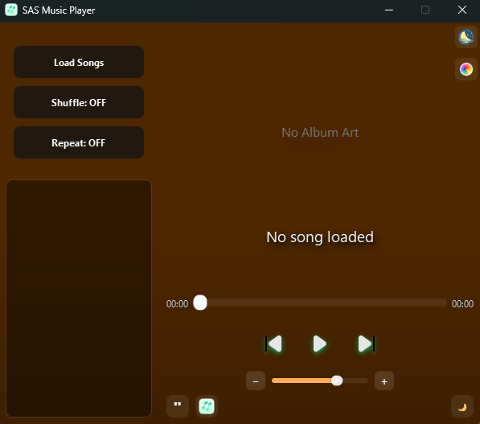

# SAS Music Player

A modern, feature-rich music player built with Python, PyQt6, and VLC, offering an elegant interface with dynamic theming and advanced playback features.


***

**[ To run the app: First go through the requirements section, then download the "Program Files" folder and run muuusic.py in your local system ]**

**[ All the files required to run or modify further reside inside the "Program Files" folder ]**

***

## ✨ Features

### 🎵 Core Functionality
- **High-Quality Playback**: VLC-powered audio engine supporting MP3, WAV, FLAC formats
- **Smart Playlist Management**: Drag & drop reordering, context menus, multi-selection
- **Shuffle and Repeat Modes**: Full control over playback patterns
- **Album Art Integration**: Automatic extraction with intelligent color theming
- **Mini Player Mode**: Compact, always-on-top floating player
- **Sleep Timer**: Auto-stop with customizable duration or end-of-song timing

### 🎨 Visual & UX
- **Dynamic Color Themes**: Auto-generated color schemes from album artwork
- **Smooth Animations**: Fade transitions and visual effects throughout the UI
- **Modern Interface**: Glass-effect sidebar, blurred backgrounds, custom widgets
- **Responsive Design**: Adaptive layouts with proper shadow effects
- **System Tray Integration**: Background operation with tray controls (Windows)
- **Dark/Light Mode Toggle**: Brightness adjustment for different environments

### 🔧 Advanced Features
- **Custom Widgets**: Scrolling labels, glow buttons, pulsing playlist indicators
- **Metadata Management**: Multi-threaded extraction of artist, album, title information
- **Keyboard Shortcuts**: Delete key for playlist management
- **File Operations**: Show in folder, drag & drop support
- **Performance Optimized**: Cached album art, efficient background processing
- **Taskbar Progress**: Windows taskbar integration showing playback progress

***

## Screenshots

### Default State


### Playback State


### Mini Player Mode


### Sleep Timer Button (Inactive)


### Sleep Timer Button (Active)


### Dark/Light Mode


***

## 🛠️ Requirements & Installation

### System Requirements
- **Python 3.9+**
- **VLC Media Player** (must be installed and accessible in PATH)
- **pip** (Python package manager)

### Install VLC Media Player
1. Download and install VLC from [https://www.videolan.org/vlc/](https://www.videolan.org/vlc/)
2. Ensure VLC is accessible in your system PATH

### Python Dependencies
```bash
# Core dependencies
pip install PyQt6 python-vlc pillow mutagen

# Windows-specific (optional, for enhanced features)
pip install pywin32  # For taskbar progress and Windows integration
```

**Package Details:**
- `PyQt6` — Modern GUI framework
- `python-vlc` — VLC media player Python bindings
- `mutagen` — Audio metadata extraction and album art
- `pillow` — Image processing for album art effects
- `pywin32` — Windows-specific taskbar integration (optional)

***

## 🚀 Usage

### Quick Start
```bash
# Navigate to the Program Files folder
cd sas-music-player/Program\ Files/

# Run the application
python muuusic.py
```

### Key Controls & Features
- **Load Songs**: Click "Load Songs" to select audio files or drag & drop files
- **Playback Controls**: Play/pause, previous/next, volume control
- **Playlist Management**: Double-click to play, drag to reorder, right-click for context menu
- **Mini Player**: Click mini player button for compact, always-on-top mode
- **Sleep Timer**: Click 🌙 button to set auto-stop timer (custom duration or end-of-song)
- **Dynamic Theming**: Click color button to customize appearance or enable auto-color from album art
- **Brightness Toggle**: Click brightness button to switch between dark/light modes
- **Keyboard Shortcuts**: Use Delete key to remove selected playlist items

***

## 📁 Project Structure

### Main Components
- **`muuusic.py`**: Main application launcher and core logic
- **`audio_controller.py`**: VLC-based media playback controller  
- **`ui_builder.py`**: UI construction and layout management
- **`mini_player.py`**: Compact player window implementation

### Supporting Modules
- **`widgets.py`**: Custom PyQt6 components (ScrollingLabel, GlowButton, PulsingDelegate, etc.)
- **`album_art_manager.py`**: Album art processing and color extraction
- **`color_settings.py`** & **`color_dialog_manager.py`**: Theme management system
- **`visual_effects_manager.py`**: Animation and visual effects engine
- **`sleep_timer_dialog.py`**: Sleep timer interface and logic
- **`thread_workers.py`**: Background processing workers for metadata
- **`styles.py`**: UI styling constants and dynamic style functions
- **`utils.py`**: Utility functions and helpers

### Assets
- **`assets/`**: Icons, images, and visual resources

***

## 🎨 Features in Detail

### Album Art & Dynamic Theming
The player automatically extracts album artwork and generates harmonious color schemes:
- Intelligent dominant color detection with brightness adjustment
- Automatic UI element color coordination across the entire interface
- Blurred background generation for immersive visual experience
- Real-time theme updates when switching tracks

### Mini Player
Floating mini player featuring:
- Always-on-top functionality for multitasking
- Drag-to-move capability anywhere on screen
- Rounded, transparent design with visual appeal
- Synchronized controls with main window
- Compact 220x220 pixel footprint

### Smart Playlist System
- Visual feedback for currently playing track with pulsing animation
- Contextual right-click menu (Play, Remove, Show in Folder)
- Drag & drop support for easy file addition
- Keyboard shortcuts for efficient management
- Multi-selection support for batch operations

***

## 🔧 Technical Details

### Architecture
- **MVC Pattern**: Clean separation of audio control, UI building, and data management
- **Signal/Slot System**: PyQt6 event-driven architecture for responsive UI
- **Multi-threading**: Background metadata extraction without UI blocking
- **Caching System**: Efficient album art and metadata storage for performance

### Performance Optimizations
- Lazy loading of UI components to reduce startup time
- Cached album artwork processing to avoid redundant operations
- Optimized visual effects rendering with hardware acceleration
- Memory-efficient image handling for large music libraries

***

## 🛠️ How to Modify / Extend

### 1. **UI Customization**
- **Main Window**: Edit `muuusic.py` in the `SASPlayer` class, focus on `setup_ui()` method
- **Mini Player**: Modify `mini_player.py` in the `MiniPlayer` class for compact UI changes
- **Custom Widgets**: Extend or create new widgets in `widgets.py`
- **Styling**: Update colors, icons, and button styles in `styles.py` and `assets/` folder

### 2. **Playback & Audio Logic**
- **Core Playback**: Edit `audio_controller.py` for VLC integration and playback controls
- **Playlist Management**: Modify playlist logic in `muuusic.py` (shuffle, repeat, navigation)  
- **Audio Format Support**: Extend supported formats in file dialogs and controller

### 3. **Adding New Features**
- **UI Elements**: Add new buttons or panels in `ui_builder.py` setup methods
- **System Integration**: Extend tray menu and system features in `muuusic.py`
- **Visual Effects**: Create new animations in `visual_effects_manager.py`
- **Dialogs**: Add custom dialogs following the pattern in `sleep_timer_dialog.py`

### 4. **Album Art & Metadata Enhancement**
- **Art Processing**: Modify `album_art_manager.py` for custom art effects
- **Metadata Extraction**: Extend `thread_workers.py` for additional metadata sources
- **Color Theming**: Enhance color extraction algorithms in `color_settings.py`

***

## 📦 Packaging as Executable (Optional)

Create a standalone executable using PyInstaller:

```bash
# Install PyInstaller
pip install pyinstaller

# Build executable (uses preconfigured .spec file)
pyinstaller muuusic.spec

# Find your executable in dist/ folder
```

The `.spec` file is preconfigured for this project with proper VLC plugin handling and asset bundling.

***

## 🐛 Troubleshooting

### Common Issues & Solutions

**VLC Not Found Error:**
- Ensure VLC Media Player is installed from [videolan.org](https://www.videolan.org/vlc/)
- Verify VLC is accessible in your system PATH
- Try reinstalling `python-vlc`: `pip uninstall python-vlc && pip install python-vlc`

**Missing Icons/Assets Error:**
- Check that the `assets/` folder exists in your project directory
- Verify icon paths in `styles.py` match your file structure
- Ensure all asset files are present and accessible

**PyQt6 Import Errors:**
- Confirm Python version compatibility (3.9+ recommended)
- Update PyQt6: `pip install --upgrade PyQt6`
- Check for conflicting PyQt installations

**Audio Playback Issues:**
- Verify audio files are not corrupted
- Test with different audio formats (MP3, FLAC, WAV)
- Check system audio settings and default playback devices

**Performance Issues:**
- Clear album art cache by restarting the application
- Reduce playlist size for better responsiveness
- Close other resource-intensive applications

***

## 🤝 Contributing

Contributions are welcome! We appreciate bug reports, feature requests, and code improvements.

### Development Setup
1. Fork the repository
2. Create a feature branch: `git checkout -b feature/your-feature-name`
3. Make your changes following the existing code style
4. Test thoroughly across different scenarios
5. Submit a pull request with a clear description

### Code Guidelines
- Follow PEP 8 Python style guidelines
- Add comments for complex logic
- Test new features with various audio files
- Ensure UI changes work in both light and dark modes

***

## 📄 License

This project is licensed under the MIT License - see the LICENSE file for details.

***

## 🙏 Acknowledgments

- **VLC Media Player** - Robust, cross-platform audio playback backend
- **PyQt6** - Powerful, modern GUI framework for Python
- **Mutagen** - Comprehensive audio metadata extraction library
- **PIL/Pillow** - Advanced image processing capabilities
- **Community Contributors** - Thanks to all who help improve this project

***

## 💡 Future Enhancements

- **Lyrics Integration**: Real-time lyric display and synchronization
- **Audio Equalizer**: Multi-band EQ with presets and custom settings
- **Playlist Management**: Import/export playlists in various formats
- **Music Discovery**: Last.fm scrobbling and recommendations
- **Extended Format Support**: Additional audio codecs and containers
- **Cloud Integration**: Support for streaming services and cloud storage
- **Keyboard Shortcuts**: Comprehensive hotkey system for power users
- **Visualization**: Audio spectrum analyzer and visual effects

***

**Created by FAiTH** - A modern music player designed for the ultimate desktop experience.

Hope you like it...………..♥